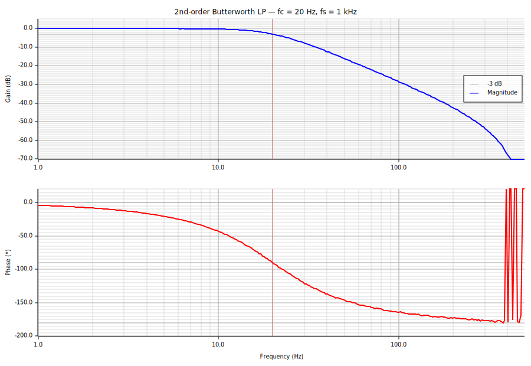
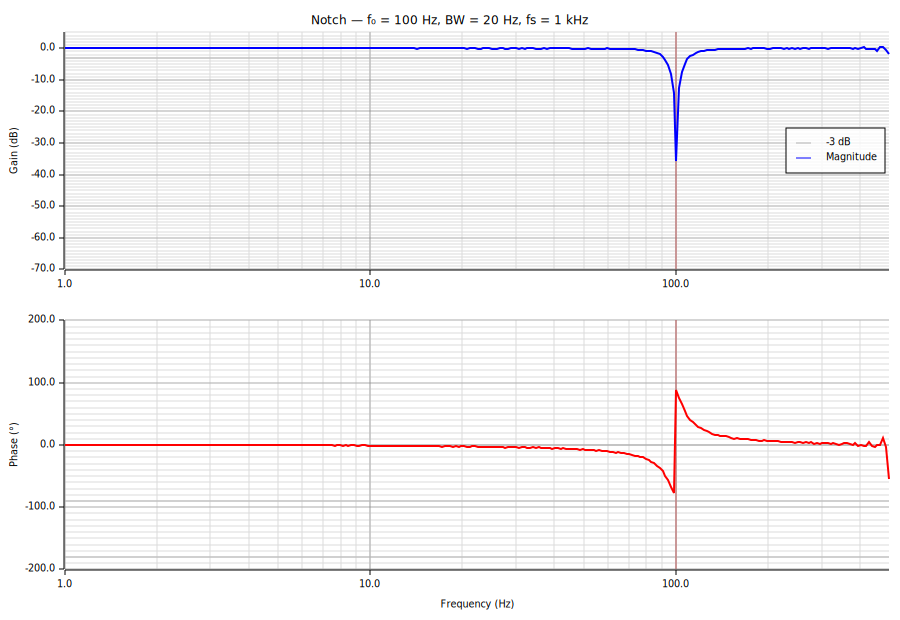

# ozonide-core::filter

A `no_std`, heap-free biquad filter library for the Ozonide flight controller.

All state is stack-allocated. Filters are built once, then driven sample-by-sample
inside the main control loop. Coefficients can be swapped live without resetting
delay-line state, which allows glitch-free re-tuning (e.g. RPM-tracking notches).

---

## Building blocks

| Type | Description |
|------|-------------|
| `BiquadraticFilter` | Single transposed-DF2 biquad section. 5 muls + 4 adds per sample. |
| `FilterChain<N>` | Cascade of up to `N` biquad sections, run in series. |
| `FilterFamily` | `Butterworth` (flat magnitude) or `Bessel` (flat group delay). |

### Factory functions

| Function | Returns |
|----------|---------|
| `lowpass(fs, fc, family, order)` | Low-pass `FilterChain` |
| `highpass(fs, fc, family, order)` | High-pass `FilterChain` |
| `notch(fs, f0, bandwidth)` | Band-reject (null at `f0`) |
| `bandpass(fs, f0, bandwidth)` | Band-pass (peak at `f0`) |

Maximum supported order: **6** (→ 3 biquad sections, `MAX_SECTIONS = 3`).

---

## Example 1 — Lowpass filter on gyro data

Low-pass filter the roll-rate channel of `ImuData` at 20 Hz, with a 2nd-order
Butterworth at 1 kHz sample rate.

```rust
use ozonide_core::filter::{Filter, FilterFamily, lowpass};
use ozonide_core::msgs::ImuData;

// Built once at startup (or on reconfiguration).
let mut roll_rate_lp = lowpass(1000.0, 20.0, FilterFamily::Butterworth, 2);

// Called every 1 ms inside the IMU task.
fn on_imu_sample(imu: &ImuData, filter: &mut Filter) -> f32 {
    let filtered_roll_rate = filter.process(imu.angular_velocity[0]);
    filtered_roll_rate
}
```



Regenerate with `cargo run -p bode-plot --target x86_64-unknown-linux-gnu` after changing
filter parameters. The tool writes directly to `src/filter/plots/` so the committed plots
stay in sync.

**Butterworth** gives a maximally flat passband — the gain is constant up to
the cutoff and then rolls off at −40 dB/decade (order 2). Use **Bessel** instead
if the control loop is sensitive to group-delay variations, since Bessel has
near-linear phase and thus constant propagation delay across the passband.

---

## Example 2 — Dynamic notch filter tracking motor RPM

Place a notch at the dominant motor vibration frequency, computed from motor
angular velocity Ω (rad/s) reported by the ESC. Update the notch every control
cycle so it tracks RPM changes without glitching the filter state.

```rust
use ozonide_core::filter::{Filter, notch};
use core::f32::consts::TAU;

// Running notch — keeps its delay-line state across coefficient updates.
let mut running_notch = notch(1000.0, 100.0, 20.0);

// Called every cycle with the latest motor Ω in rad/s.
fn update_notch(running: &mut Filter, omega_rad_s: f32, sample_rate: f32) {
    // Convert angular velocity to Hz.
    let f0_hz = omega_rad_s / TAU;

    // Build a fresh notch with the new centre frequency (cheap: only trig at construction).
    // Bandwidth of 20 Hz gives Q = f0 / 20.
    let fresh = notch(sample_rate, f0_hz, 20.0);

    // Copy coefficients into the running filter without touching z1/z2.
    // This is the glitch-free re-tune path.
    running.update_coefficients_from(&fresh);
}

// In the control loop:
fn on_control_tick(
    gyro_z: f32,
    running: &mut Filter,
    omega: f32,
) -> f32 {
    update_notch(running, omega, 1000.0);
    let filtered_gyro_z = running.process(gyro_z);
    filtered_gyro_z
}
```



`update_coefficients_from` copies only the `b0..b2` / `a1..a2` words — the
delay registers `z1` and `z2` in the running filter are left untouched, so
there is no transient on the output when the notch frequency shifts.
